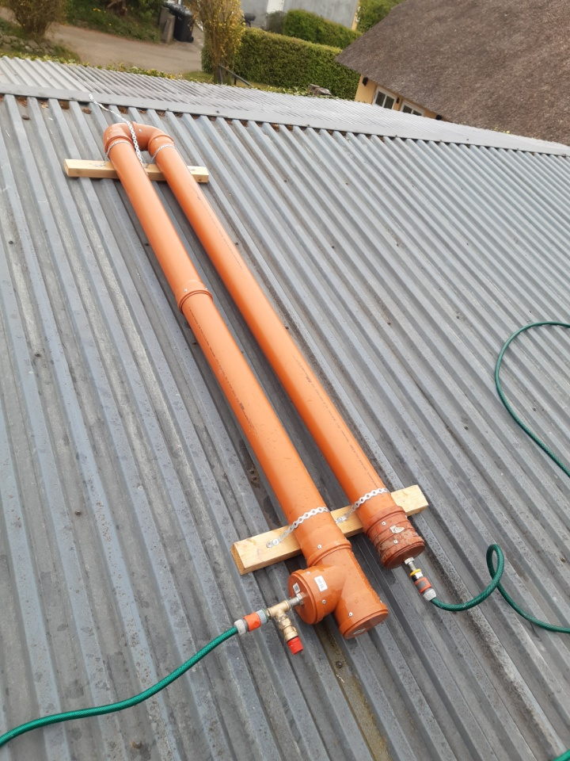

## Som projekt...

BANKEHUSET er et *Wifi enabled* Vandtæt Termometer fra Dallas Instruments. Eller det er det i hvert fald blevet til. Det er et arduino-lignende projekt lavet til at tage vandtemperaturen af vand opsamlet i PVC rør, placeret på taget af et hus, der således varmer vandet op med sol energi. Tiltænkt til et ude-bad til sommer/forår.

Ud over at den tager temperaturen på vandet, så sender den også dataen til en database *i skyen*, hvor den lagres med et timestamp, og øvrig vejrdata fra openweathermap's API.

Det information serveres så på et statisk genereret website, så ejerne af Bankehuset (det fysiske hus) kan se om vandet på taget er klart til et udendørs bad, eller ej.

I projektets ånd er BANKETHUSET 100% drevet af solen, via et solcellepanel der lader et batteri op, som holder den lille enhed kørende.

**Den fysiske enhed er bestående af:**
- DS18B20U 
- ESP8266/NodeMCU
- Et par LEDs
- Et par push buttons
- Et batteri
- Et solcellepanel